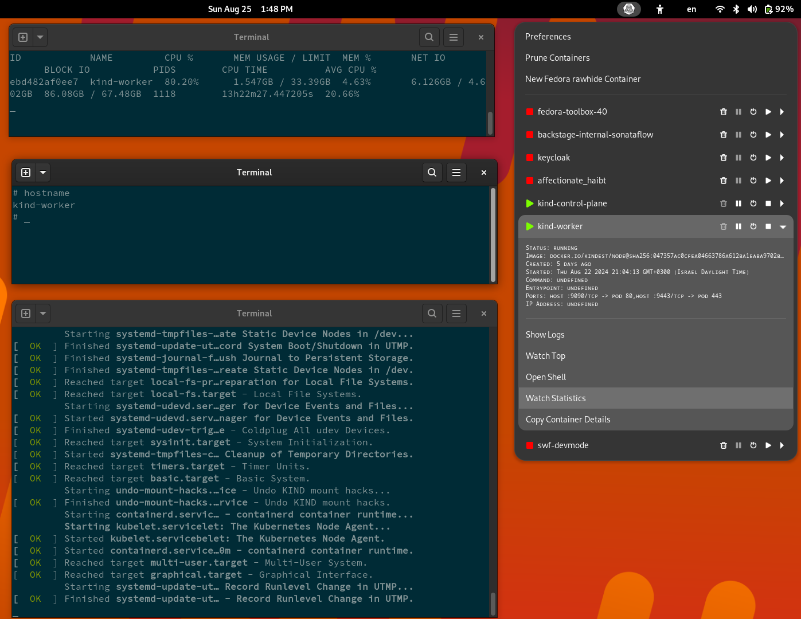

# GNOME Shell Extension: Containers

**Manage Linux containers seamlessly using Podman within the GNOME Shell.**
  
  


## Features ✨

This extension provides a convenient GNOME Shell menu to manage your Podman containers. Supported actions include:

- **Start**: Initialize containers. 🚀
- **Stop**: Terminate running containers. 🛑
- **Remove**: Delete containers. 🗑️
- **Pause**: Suspend container processes. ⏸️
- **Restart**: Reboot containers. 🔄
- **Top Resources**: Display resource usage stats. 📊
- **Shell Access**: Open a terminal shell in the container. 🔧
- **Live Stats**: View real-time statistics in a new terminal. 📈
- **Logs Monitoring**: Follow logs in a new terminal session. 📋
- **Inspect Info**: View and copy detailed inspection information. 🔍

## Installation 🛠️

### From GNOME Extensions Page 🌐
You can install this extension directly from the [GNOME Extensions page](https://extensions.gnome.org/extension/1500/containers/).

### From Source 📂

1. **Clone the repository:**
   ```bash
   git clone https://github.com/rgolangh/gnome-shell-extension-containers
   cd gnome-shell-extension-containers
   ```
   
2. Build and install:

  ```bash
  make all
  ```

3. Enable the extension:

  ```bash
  make enable
  ```

Alternatively, enable it via Extensions -> Toggle 'Containers'.

## Development / Contributing 🤝

To contribute to the development of this extension:

Clone the repository and make your changes.
Debugging: Spin up an inline GNOME Shell session in a dedicated window:
  
  ```bash
  make debug
  ```

Contributions are welcome! Please ensure your code follows the project’s style guidelines and is thoroughly tested before submitting a pull request.

## Screenshot 📸



## License 📜

Apache-2.0 License
